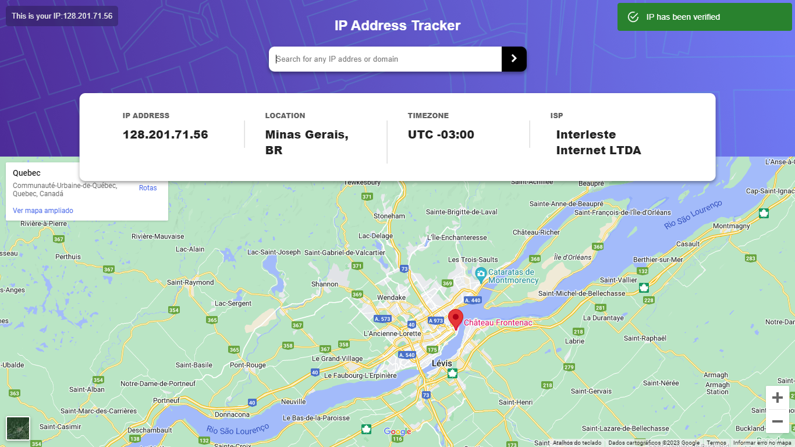
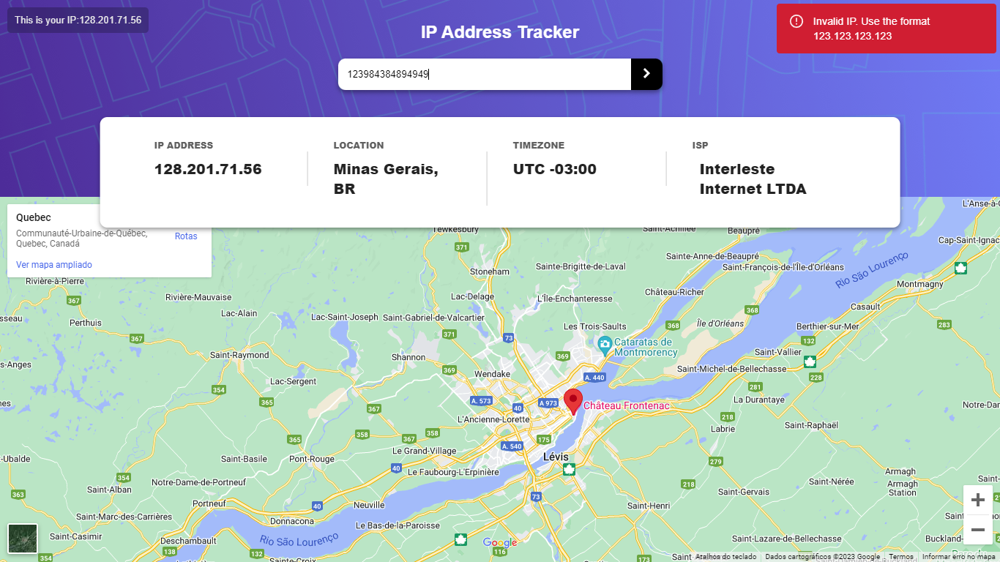

# Frontend Mentor - IP address tracker solution

This is a solution to the [IP address tracker challenge on Frontend Mentor](https://www.frontendmentor.io/challenges/ip-address-tracker-I8-0yYAH0). Frontend Mentor challenges help you improve your coding skills by building realistic projects.

## Table of contents

- [Screenshot](#screenshot)
- [Links](#links)
- [Built with](#built-with)
- [Author](#author)

### Screenshot

##### Links

- Live Site URL: [Add live site URL here](https://your-live-site-url.com) 

### Built with

- Semantic HTML5 markup
- CSS custom properties
- SASS
- Flexbox
- React

## Author

- Frontend Mentor - [@AltamiroF-22](https://www.frontendmentor.io/profile/AltamiroF-22)
- Instagram - [@junior.rx22](https://www.instagram.com/junior.rx22/)
